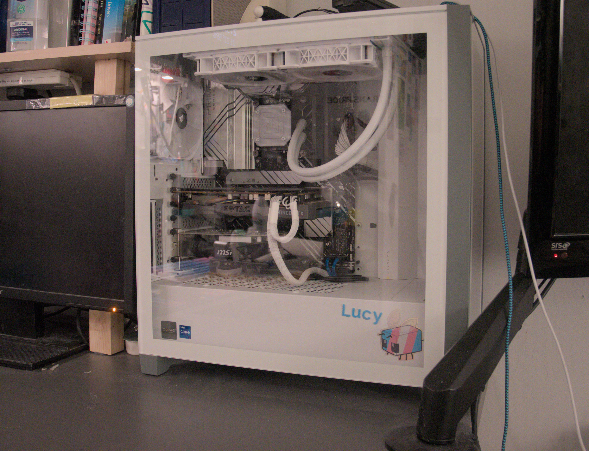
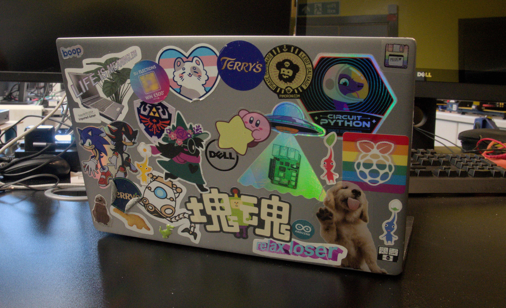
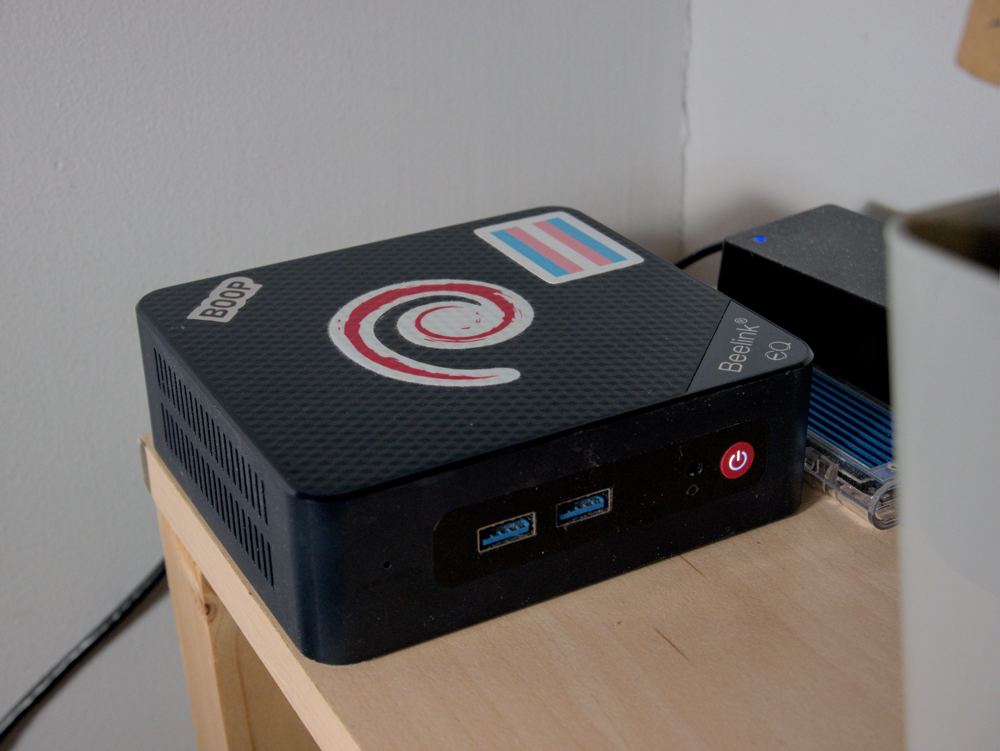



<h1>{{page.title}}</h1>

I thought it would be fun to talk about the hardware and software I regularly use.  I've spent most of my experience of computers using free and open source software, and that still holds true today.  This list doesn't include *everything*, but it does include what I use the most, and what I would recommend to others!

I hope you find this entertaining or useful in some way!

# My Computers
## Lucy
My main PC, a custom build I made in 2022.

    

        <table class="table">
            <tr>
                <td>CPU</td>
                <td><b>Intel i7-13700KF</b></td>
            </tr>
            <tr>
                <td>RAM</td>
                <td><b>Corsair Vengeance 64GB 4800MHz DDR5</b> (2x32GB kit)</td>
            </tr>
            <tr>
                <td>GPU</td>
                <td><b>Nvidia GeForce 1080 Ti</b> (with broken video ports) <b>AMD Radeon RX550</b> (with working video ports)</td>
            </tr>
            <tr>
                <td>Storage</td>
                <td><b>WD Black SN770 1TB SSD</b> boot drive <b>2 x Seagate Barracuda (ST2000DM008) 2TB HDD</b> in RAID 1 for long term storage</td>
            </tr>
            <tr>
                <td>Motherboard</td>
                <td><b>ASUS Z960-P WiFi</b></td>
            </tr>
            <tr>
                <td>Cooling</td>
                <td><b>Corsair iCUE H100i Elite Capellix AIO</b></td>
            </tr>
            <tr>
                <td>Case</td>
                <td><b>Corsair 4000X</b></td>
            </tr>
            <tr>
                <td>Extra</td>
                <td>an RS232 serial port</td>
            </tr>
            <tr>
                <td>Software</td>
                <td>EndeavourOS</td>
            </tr>
        </table>
    

    

        
    

 

## atc-xps
My current laptop, a Dell XPS 13 going strong since 2017.

    

        <table class="table">
            <tr>
                <td>Model</td>
                <td><b>Dell XPS 13 9360</b></td>
            </tr>
            <tr>
                <td>CPU</td>
                <td><b>Intel i7-7500U</b></td>
            </tr>
            <tr>
                <td>RAM</td>
                <td><b>16GB DDR4</b></td>
            </tr>
            <tr>
                <td>Storage</td>
                <td><b>500GB SSD</b> boot drive</td>
            </tr>
            <tr>
                <td>Software</td>
                <td>EndeavourOS</td>
            </tr>
        </table>
    

    

        
    

 

## atc-server
A little mini PC I use as my home server.

    

        <table class="table">
            <tr>
                <td>Model</td>
                <td><b>Beelink EQ12</b></td>
            </tr>
            <tr>
                <td>CPU</td>
                <td><b>Intel N100</b></td>
            </tr>
            <tr>
                <td>RAM</td>
                <td><b>Crucial 16GB 5600 MHz SODIMM</b></td>
            </tr>
            <tr>
                <td>Storage</td>
                <td><b>500GB SSD</b> boot drive</td>
            </tr>
            <tr>
                <td>Software</td>
                <td>Debian 12</td>
            </tr>
        </table>
    

    

        
    

 

# My Equipment
### Engineering Equipment
- Rigol DS1054Z Oscilliscope, naturally [hacked](https://gotroot.ca/rigol/riglol/) to unlock extra bandwidth
- Tenma 72-10505 Bench Power Supply
- Generic Desoldering Gun
- TS80 Soldering Iron, its tiny and baby
- Ender 3 V2 3D printer
  - stored in an enclosure built from a tower of three IKEA LACK tables, based on [this thing by Silverlane](https://www.thingiverse.com/thing:2978880)

### Audio Visual Equipment
- [Panasonic GX80](https://www.panasonic.com/uk/consumer/cameras-camcorders/lumix-mirrorless-cameras/lumix-g-cameras/dmc-gx80eb.html) camera, I actually talked about it in my [post about the Photos section](/posts/2024/10/29/photography-section.html#the-new-camera)
- [Sennheiser HT 450BT](https://www.sennheiser-hearing.com/en-UK/p/hd-450bt/) Headphones, I only recently got them so I can't say how they are in the long term, but they are pretty good so far!
- Two cheap 24" Acer monitors.  One of them only has VGA in
- an [Extron DXP 44 HDMI](https://www.extron.com/product/dxphdmi) matrix switcher which I use for routing video from Lucy and other inputs, to my monitors and capture card.  I got it on eBay for £15!
- minimixer, a little USB audio interface and mixer I built which you can't buy (yet...)

# My Software

### Operating Systems
- [EndeavourOS](https://endeavouros.com/) is an Arch-based Linux distro that I use as my main OS.  I like it because it has the minimality of Arch but makes sure everything's installed correctly
  - [KDE Plasma](https://kde.org/plasma-desktop/) as my main desktop environment
  - I've been trying [Hyprland](https://github.com/hyprwm/Hyprland) and so far I really like the tiling behaviour!  Although I'm thinking of trying out [niri](https://github.com/YaLTeR/niri) for a bit, since it seems better equipped to handle my multiple concurrent thought processes
- [Debian](https://www.debian.org/) for my servers, since it's really stable especially when running system updates
- [LineageOS](https://lineageos.org/) on my phone.  I tried to de-google as much as I could I couldn't get stuff like notifications working. 

### Productivity
- [Joplin](https://joplinapp.org/) for cloud-synced notes
- [Zotero](https://www.zotero.org/) for managing citations for my research
- [Qalculate!](https://qalculate.github.io/) to calculate stuff.  It has some pretty nifty features like unit conversion, built-in constants and functions.
- [Thunderbird](https://www.thunderbird.net/en-GB/) for managing my multiple email accounts in one place
- [Firefox Developer Edition](https://www.mozilla.org/en-US/firefox/developer/) as my web browser, since unlike the normal version of Firefox extensions loaded from a file system don't remove themselves on restart :/

### Development
- [Visual Studio Code](https://code.visualstudio.com/) as my code editor, along with a bunch of extensions:
  - [Remote Development](https://marketplace.visualstudio.com/items?itemName=ms-vscode-remote.vscode-remote-extensionpack) lets you open a VSCode workspace *on another computer* over SSH!  it's really useful for working on servers
  - [Container Tools](https://marketplace.visualstudio.com/items?itemName=ms-azuretools.vscode-containers) for managing running containers and bringing up Docker Compose files (very very useful in remote sessions!)
  - [rust-analyser](https://marketplace.visualstudio.com/items?itemName=rust-lang.rust-analyzer), [Python](https://marketplace.visualstudio.com/items?itemName=ms-python.python), and [C/C++](https://marketplace.visualstudio.com/items?itemName=ms-vscode.cpptools) for working on my usual languages
  - [PlatformIO](https://marketplace.visualstudio.com/items?itemName=platformio.platformio-ide) My Beloved, a build system for several different embedded software SDKs including Arduino.  (seriously this is one of my favourite pieces of software ever)
  - [LaTeX Workshop](https://marketplace.visualstudio.com/items?itemName=James-Yu.latex-workshop) for authoring all my LaTeX documents
  - [OpenSCAD](https://marketplace.visualstudio.com/items?itemName=Antyos.openscad) for working on OpenSCAD files
  - [Markdown All In One](https://marketplace.visualstudio.com/items?itemName=yzhang.markdown-all-in-one) for quality of life improvements for writing in Markdown
  - [Bookmarks](https://marketplace.visualstudio.com/items?itemName=alefragnani.Bookmarks) for keeping track of where specific lines of code are in huge source files
  - [Todo Tree](https://marketplace.visualstudio.com/items?itemName=Gruntfuggly.todo-tree) adds a panel at the side showing anywhere you have `TODO` written in your code
  - [Code Spell Checker](https://marketplace.visualstudio.com/items?itemName=streetsidesoftware.code-spell-checker) because speling is dificullt
  - [Eva Theme](https://marketplace.visualstudio.com/items?itemName=fisheva.eva-theme) for making my VSCode look like it's covered in sprinkles
  - [Catppuccin Icons](https://marketplace.visualstudio.com/items?itemName=Catppuccin.catppuccin-vsc-icons) for making my files look really cool
  - and a lot more!
- [`tio`](https://github.com/tio/tio) as my terminal serial port monitor of choice

### CAD
- [KiCAD](https://www.kicad.org/) for designing PCBs; it's completely free and really good!  I absolutely recommend it!
- [OpenSCAD](https://openscad.org/) for 3D CAD, really because I don't know how to use normal CAD software
- [Cura](https://ultimaker.com/software/ultimaker-cura/) for slicing 3D models for 3D printing
  - and sometimes [PrusaSlicer](https://www.prusa3d.com/page/prusaslicer_424/)
- [OctoPrint](https://octoprint.org/) to manage my Ender 3.  It's running on a Raspberry Pi Zero 2W screwed into the bottom of the enclosure

### Homelab Software
- [Pihole](https://pi-hole.net/) as an ad and tracker blocker, and also as a DNS server for my LAN
- [Nextcloud](https://nextcloud.com/athome/) for personal file, calendar, task, and contact synchronisation
- [Jellyfin](https://jellyfin.org/) as a home media server
- [Home Assistant](https://www.home-assistant.io/) to operate a single Wifi lightbulb I own
- [SearxNG](https://github.com/searxng/searxng) search engine aggregator
- [InvenTree](https://inventree.org/) to keep track of my electronic component inventory (not that I ever keep it up to date...)